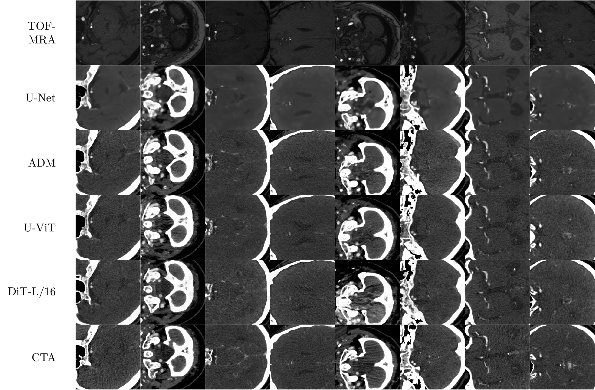

# Cross-modality image synthesis from TOF-MRA to CTA

[](https://arxiv.org/abs/2409.10089)
[](https://doi.org/10.1016/j.media.2025.103722)

This repository contains the code for the [paper](https://doi.org/10.1016/j.media.2025.103722).
We explore diffusion-based image-to-image translation models to generate synthetic CTA images from TOF-MRA input.



## Installation

We use Python 3.9 for development.
The code is written in [JAX](https://jax.readthedocs.io/en/latest/) and [Flax](https://flax.readthedocs.io/en/latest/).

```bash
git clone https://github.com/alexander-koch/xmodality.git
cd xmodality
pip install -r requirements.txt
```

You can run the Diffusion Transformer locally on your Mac via [Apple MLX](https://github.com/ml-explore/mlx).
For MLX support, you need an M-series chip (Apple Silicon) and macOS >= 13.5.

```bash
pip install mlx
```

## Download the weights

Pre-trained weights are available on Hugging Face [xmodality](https://huggingface.co/alexander-koch/xmodality).
You can download them via wget like this:

```bash
wget https://huggingface.co/alexander-koch/xmodality/resolve/main/dit.safetensors
```

To verify, here are the md5sums:

```bash
$ md5sum unet.safetensors
f0c09e5c91b7a8451b0879a5ef55902f  unet.safetensors

$ md5sum adm.safetensors
8603c2805aad4e98420824bd9cb6795a  adm.safetensors

$ md5sum uvit.safetensors
md6ed96a0f83e1ffa213e8f37ff82ac496e  uvit.safetensors

$ md5sum dit.safetensors
af495d740288c2870e4c0a3bbb1ee84c  dit.safetensors
```

## Converting some TOF-MRAs

You can either use `inference.py` or `resampled_inference.py`.
Resampling additionally resamples to fit within the 256x256 range during generation.
Use it like this:

```bash
python3 resampled_inference.py --input <path/to/tof> --output <path/to/cta> --load weights/uvit.pkl --arch uvit --bfloat16
```

or run the model on full resolution like this:

```bash
python3 inference.py --input <path/to/tof> --output <path/to/cta> --load weights/uvit.pkl --arch uvit --bfloat16
```

For Mac users, you can run the Diffusion Transformer model locally like this:

```bash
python3 mlx_inference.py --input <path/to/tof> --output <path/to/cta> --load <path/to/weights> --num_sample_steps <num_sample_steps>
```

All scripts print more detailed information on possible settings and parameters by using the `--help` flag, i.e.

```bash
python3 resampled_inference.py --help
```

## Training and Evaluation

See [Training](docs/Training.md) for more information on how to train your model.
See [Evaluation](docs/Evaluation.md) for more information on how to evaluate a model.

## Speed

Inference speed on a 512x512x160 TOF-MRA image using a batch size of 64, float32 precision, DDPM sampling, using the resampled inference script

| Device       | Time (4 steps) | Time (32 steps)   | Time (100 steps)  |
|--------------|----------------|-------------------|-------------------|
| NVIDIA A40   | ~15s           | ~50s              |  ~2min            |
| Apple M3 Pro | ~40s           | ~6min             | ~17min            |

## Organization

* `figures/` - Files to reproduce and generate data for the figures of the paper
* `extra/` - Files to reproduce and generate data for the appendix
* `sh/` - Scripts to run the experiments on the HPC
* `docs/` - Files for documentation
* `scripts/` - Additional scripts
* `compute_fd.py` - Computes the Frechet Distance on ViT
* `external_validation.py` - Computes 3D metrics on internal and external dataset

For any evaluation-related tasks, you will need to download the ViT-B/16 weights.

## Contributing

You found a mistake or have an improvement?
Happy to hear, send us your pull requests or file an issue! 

## Acknowledgments

This codebase borrows parts from 

* https://github.com/lucidrains/denoising-diffusion-pytorch/
* https://github.com/crowsonkb/jax-wavelets
* https://github.com/facebookresearch/DiT

## Citation

If you use this project, please cite our Medical Image Analysis article:

```bibtex
@article{koch2025-xmodality,
    title = {Cross-modality image synthesis from {TOF-MRA} to {CTA} using diffusion-based models},
    journal = {Medical Image Analysis},
    volume = {105},
    pages = {103722},
    year = {2025},
    issn = {1361-8415},
    doi = {https://doi.org/10.1016/j.media.2025.103722},
    url = {https://www.sciencedirect.com/science/article/pii/S1361841525002695},
    author = {Alexander Koch and Orhun Utku Aydin and Adam Hilbert and Jana Rieger and Satoru Tanioka and Fujimaro Ishida and Dietmar Frey},
    keywords = {Diffusion, Image-to-image translation, Angiography imaging},
}
```
